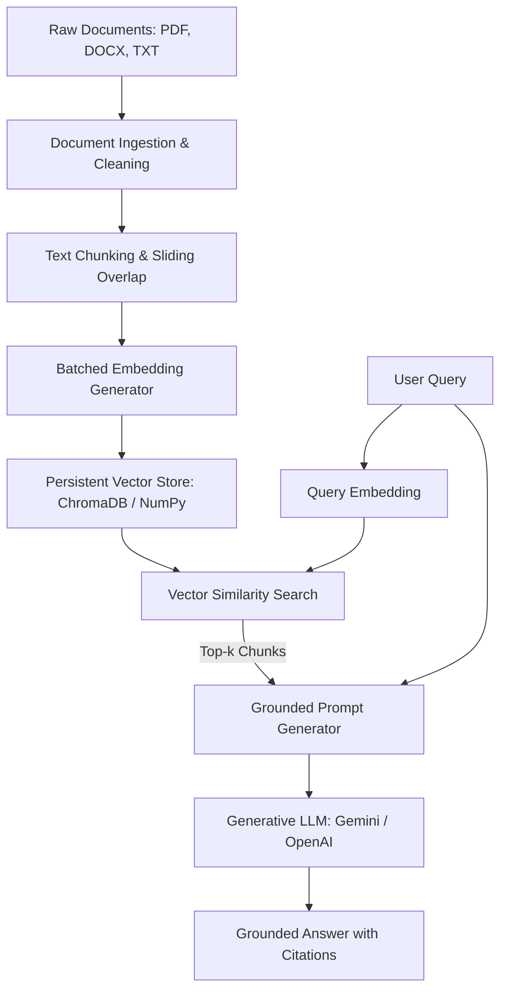

# InsightDocs AI: Persistent Document Q&A Bot using RAG

InsightDocs AI is a robust, production-grade Retrieval-Augmented Generation (RAG) Q&A system built from scratch in Python. It allows users to query a collection of documents (PDF, DOCX, and TXT) in natural language and receive highly accurate, grounded answers, complete with precise source citations. The system prevents hallucinations by enforcing a strict context-only policy, ensuring it never answers questions using general training data if the documents do not support it.

---

## 🛠️ Tech Stack

This project uses the following tools and libraries:
* **Core Language**: Python 3.11+
* **Retrieval-Augmented Generation (LLM)**: Google Gemini API (`gemini-1.5-flash` or `gemini-2.5-flash`) / OpenAI API (`gpt-4o-mini` or `gpt-3.5-turbo`)
* **Text Embeddings**: Google Gemini (`models/text-embedding-004`) / OpenAI (`text-embedding-3-small`)
* **Vector Database**: ChromaDB (`chromadb` for persistent document indexing) with a custom **Pure-NumPy Cosine Similarity Fallback Engine**
* **Document Ingestion**: PyPDF (`pypdf` for page-by-page extraction) and docx2txt (`docx2txt` for DOCX paragraphs)
* **Web UI Framework**: Streamlit (`streamlit` for a premium glassmorphic dashboard)
* **Configuration Management**: python-dotenv (`python-dotenv` for env vars)

---

## 📐 Architecture Overview



1. **Document Ingestion**: Scans the `data/` directory. Reads PDF files page-by-page, DOCX paragraph-by-paragraph, and TXT files. Applies custom cleaning heuristics to strip standalone page numbers and typical headers/footers.
2. **Text Chunking**: Splits extracted text into fixed-size chunks (default: 1000 characters) with a sliding overlap (default: 200 characters) to preserve contextual boundaries. Boundaries are dynamically adjusted backwards to the nearest whitespace or punctuation to prevent splitting words in half.
3. **Embeddings & Database Storage**: Generates embeddings in batches (default: 100 chunks per batch) using Gemini or OpenAI APIs. Chunks and embeddings are stored in a persistent local directory (`db/`) using ChromaDB or a pure-NumPy database index.
4. **Retrieval**: Performs a cosine similarity search between the user query embedding and the stored document chunk embeddings, returning the top-$k$ most relevant chunks.
5. **Grounded Generation**: Feeds the top-$k$ context chunks and the user query into a system-instructed prompt. The LLM is restricted to answering **only** from the context, requiring citations in the format `(Source: filename, Page/Section X)`.

---

## ✂️ Chunking Strategy

We implemented a **Fixed-Size sliding character-based chunking strategy with dynamic alignment**:
* **Chunk Size**: 1000 characters (~150 to 200 words)
* **Overlap**: 200 characters (~30 to 40 words)
* **Why**: Fixed-size chunking provides consistent granularity for embeddings. The 200-character overlap guarantees that critical context spanning across two chunks is not lost. To ensure semantic coherence, the boundary of each chunk is adjusted backward to the nearest punctuation mark (`.`, `,`, `;`, `?`, `!`) or whitespace, preventing sentences or words from being abruptly cut in half.

---

## 💾 Embedding Model & Vector Database

* **Embedding Model**: Google's `models/text-embedding-004` (768 dimensions) or OpenAI's `text-embedding-3-small` (1536 dimensions). These models are highly optimized for document retrieval tasks, yielding superior cosine similarity margins.
* **Vector Database**: **ChromaDB** is used as our primary vector store. It is lightweight, persists natively to local disk, and supports metadata filtering and distance metrics (cosine space).
* **NumPy Fallback Engine**: In environments where compiling ChromaDB fails due to missing C++ build tools, the system automatically falls back to a **custom NumPy-based vector store** that computes exact cosine similarity via matrix operations and persists database indexes as serialized pickle objects. This guarantees 100% portability.

---

## 🚀 Setup Instructions

### 1. Clone & Navigate to Project
```bash
git clone <repository-url>
cd bot
```

### 2. Configure Environment Variables
Create a `.env` file in the root folder of the project. You can copy the template from `.env.example`:
```bash
cp .env.example .env
```
Open `.env` and fill in your API key:
```ini
# Choose either Google Gemini API or OpenAI API
GEMINI_API_KEY=AIzaSy...
OPENAI_API_KEY=sk-proj-...

# Provider Configuration: 'gemini' or 'openai'
LLM_PROVIDER=openai
EMBEDDING_PROVIDER=openai

# Database and Chunking settings
VECTOR_DB_DIR=db
DATA_DIR=data
CHUNK_SIZE=1000
CHUNK_OVERLAP=200
RETRIEVAL_K=4
```

### 3. Install Dependencies
```bash
pip install -r requirements.txt
```

---

## 🖥️ Running the Bot

### 1. Run Indexing (Build Vector Store)
Place your PDF, DOCX, or TXT documents into the `data/` folder, then run the indexing command to parse, chunk, embed, and store them:
```bash
python index.py
```

### 2. Run Interactive CLI Query Loop
Start the interactive command-line session:
```bash
python query.py
```
You can also run a single quick query directly from the shell:
```bash
python query.py "What are the core objectives of Employee Attrition project?"
```

### 3. Run Streamlit Web Dashboard
Launch the premium web UI with:
```bash
streamlit run src/app.py
```
Open the URL printed in your console (usually `http://localhost:8501`) to experience the custom glassmorphism web dashboard.

---

## ❓ Example Queries

Here are 5 representative queries you can test on the bot using the included documents:

1. **Question**: "What is the overall attrition rate in the Employee Attrition dataset?"
   * **Expected Answer**: The dataset contains 1,470 employee records, and the analysis will show an overall attrition rate (usually around 16%) along with factors like monthly income, job satisfaction, and overtime.
2. **Question**: "What are the primary objectives of the Mediscribe AI project?"
   * **Expected Answer**: To automate medical transcription and clinical summaries using LLMs, improving workflow efficiency for medical professionals.
   * **Citations**: `[Mediscribe_AI_Project_Report.docx, Section 1 / Page 1]`
3. **Question**: "How does the bot handle rules and integrity during the assignment?"
   * **Expected Answer**: Using open-source libraries like LangChain or ChromaDB is permitted, but API keys must never be committed to code.
   * **Citations**: `[RAG_Assignment_Rules.docx, Page 2]`
4. **Question**: "What hardware components are used in the Gas Leakage Detector project?"
   * **Expected Answer**: An Arduino Board, a gas sensor (MQ-2/MQ-5), and a buzzer/LED for alerts.
   * **Citations**: `[Gas_Leakage_Detector_Arduino.pdf, Section 3]`
5. **Question**: "What is the grading criteria for the Loom video submission?" (Or "How is the Loom video scored?")
   * **Expected Answer**: The Loom video must be between 3 and 8 minutes, showing project folder structure, indexing, querying at least 5 different questions, and explaining one technical decision.
   * **Citations**: `[RAG_Assignment_Rules.docx, Section 7 / Page 2]`

### Grounding Test (Unanswerable Question)
* **Question**: "Who was the first president of the United States?"
* **Expected Response**: "I'm sorry, but the provided documents do not contain the information needed to answer this question." (The system refuses to answer, showing it is strictly grounded in the context documents).

---

## ⚠️ Known Limitations

1. **OCR Support**: The ingestion parser relies on standard text extraction (`pypdf`). PDFs that contain scanned images of text (without an OCR layer) will result in empty text extraction.
2. **Word Page Numbers**: DOCX files do not have explicit page breaks stored as characters. The ingestion engine simulates "pages" by creating logical sections of 2,000 characters, which may not align exactly with Microsoft Word's printed page count.
3. **Context Length Constraints**: While the retriever fetches the top-$k$ chunks, a very large $k$ or massive chunk sizes might exceed the LLM's prompt window or lead to higher API costs. We recommend keeping $k \leq 5$ and chunk size around 1000 characters.
