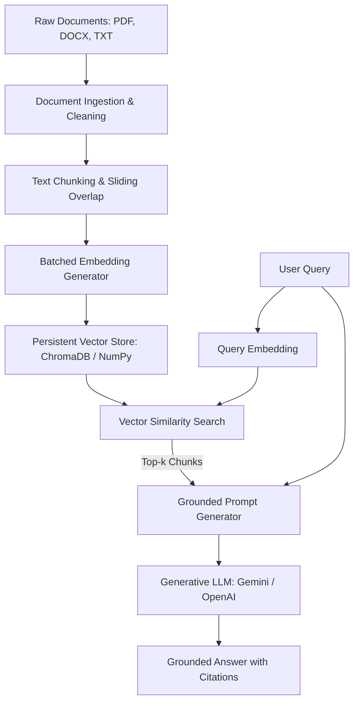

# InsightDocs AI: Q&A Bot using RAG

InsightDocs AI is an advanced, secure Retrieval-Augmented Generation (RAG) document assistant. It allows users to upload files (PDFs, DOCX, TXT, MD) into isolated chat sessions and ask natural language questions. The assistant retrieves relevant passages from the documents and uses an LLM to generate precise, grounded answers that include inline source and page citations, preventing hallucinations.
---

## Tech Stack

The project is built entirely on Python and utilizes the following libraries:

**streamlit (>=1.30.0)**:Provides the interactive web user interface, chat bubble outputs, and sidebar controls.
**chromadb (>=0.5.0)**:A lightweight, local vector database utilized to persist document embeddings and search context.
**pypdf (>=4.0.0)**: Extracts clean text content page-by-page from PDF files.
**docx2txt (>=0.8)**: Extracts textual contents and layout details from Word Document (.docx) files.
**google-generativeai (>=0.8.3)**: Official SDK for Google Gemini models to generate text-embeddings and complete Q&As.
**openai (>=1.0.0)**: Official SDK for OpenAI models supporting GPT and text-embedding models.
**python-dotenv (>=1.0.0)**: Loads settings and API credentials from the local .env file.
**numpy (>=1.24.0)**
: Handles fallback array math and vector cosine similarity computations when ChromaDB is disabled or unavailable.

---

## Architecture Overview



1.**Ingestion (src/ingestion.py)**:  Reads the uploaded files, cleans out footer/header noise (like single-page numbers or minor artifacts), and produces text sections paired with source and page metadata.
2.**Chunking (src/chunking.py)**: Splits the extracted text into overlapping segments of uniform size.
3.**Embedding (src/embeddings.py)**: Converts the text segments into dense vector representations using Gemini (models/text-embedding-004) or OpenAI (text-embedding-3-small).
4.**Vector DB (src/vector_store.py)**: Stores the chunk text, vector embeddings, and metadata. By default, it uses ChromaDB (saved locally in subfolders). If Chroma fails to build, the app automatically switches to a pure-Python fallback NumPyVectorStore that serializes array indices directly to disk using pickle.
5.**Retrieval (src/retriever.py)**: Embeds the user query and queries the database for the top-k most similar chunks using Cosine Similarity.
6.**Generation (src/generator.py)**: Builds a grounding prompt containing only the retrieved chunks and the user's query. The LLM (Gemini or OpenAI) is instructed to answer using only the provided chunks, cite sources inline, and output a specific message if the context is insufficient.
---

## Chunking Strategy

**Strategy Chosen:** Overlapping sliding window chunking with punctuation boundary alignment.
**Default Parameters:** chunk_size = 1000 characters, chunk_overlap = 200 characters.
**Why:**
**Context Preservation:** 1000 characters (around 150-200 words) represents an optimal block of semantic meaning (like a full paragraph or multiple sentences) for embeddings to capture.
**Overlap Protection:** A 200-character overlap prevents critical details from being truncated or lost if a key concept lands directly on a chunk boundary.
**Punctuation Boundary Alignment:** The chunker looks backward up to the overlap limit to split text cleanly on characters like periods, commas, or spaces. This prevents splitting words or breaking sentences mid-thought, producing high-quality retrievals.


---

## 💾 Embedding Model & Vector Database

**Embedding Model:** Google's models/text-embedding-004 (768 dimensions) or OpenAI's text-embedding-3-small (1536 dimensions).
Reason: Both models represent state-of-the-art semantic representation, providing low-cost, fast, and high-quality vector embeddings.
**Vector Database:** ChromaDB with a native NumPy fallback.
**Reason:** ChromaDB is an in-process database that is highly performant and requires zero configuration or external servers. However, since ChromaDB compiles binary C++ HNSW libraries, it can fail to install on some restricted environments. The inclusion of a pure-Python NumPy fallback ensures the application runs seamlessly out-of-the-box on any machine.

---

## Setup Instructions

### 1. Clone & Navigate to Project
```bash
git clone <repository-url>
cd bot
```

### 2: Create a Virtual Environment
python -m venv venv

**Activate the environment:**
Windows:
venv\Scripts\activate
macOS / Linux:
source venv/bin/activate


### 3. Install Dependencies
```bash
pip install -r requirements.txt
```

### 4: Configure Environment Variables
Create a file named .env in the root directory by copying the example:
copy .env.example .env
Open .env and fill in your API keys


## 🖥️ Running the Bot

### 1. Run Indexing (Build Vector Store)
Place your PDF, DOCX, or TXT documents into the `data/` folder, then run the indexing command to parse, chunk, embed, and store them:
```bash
python index.py
```

### 2. Run Interactive CLI Query Loop
Start the interactive command-line session:
```bash
python query.py
```
You can also run a single quick query directly from the shell:
```bash
python query.py "What are the core objectives of Employee Attrition project?"
```

### 3. Run Streamlit Web Dashboard
Launch the premium web UI with:
```bash
python -m streamlit run src/app.py
```
Open the URL printed in your console (usually `http://localhost:8501`) 

---

### 7. Environment Variables Config
The .env configuration file supports the following parameters:
# API Keys (Never commit actual keys to source control)
OPENAI_API_KEY=your_openai_api_key_here
GEMINI_API_KEY=your_gemini_api_key_here

# Providers Config
LLM_PROVIDER=openai           # Choice: "openai" or "gemini"
EMBEDDING_PROVIDER=openai     # Choice: "openai" or "gemini"

# Models Config
OPENAI_MODEL=gpt-4o-mini
OPENAI_EMBEDDING_MODEL=text-embedding-3-small
GEMINI_MODEL=gemini-1.5-flash
GEMINI_EMBEDDING_MODEL=models/text-embedding-004

# Database and Ingestion Parameters
VECTOR_DB_DIR=db
DATA_DIR=data
CHUNK_SIZE=1000
CHUNK_OVERLAP=200
RETRIEVAL_K=4

## ❓ Example Queries

Here are 5 representative queries you can test on the bot using the included documents:

1. **Question**: "What is the overall attrition rate in the Employee Attrition dataset?"
   * **Expected Answer**: The dataset contains 1,470 employee records, and the analysis will show an overall attrition rate (usually around 16%) along with factors like monthly income, job satisfaction, and overtime.
2. **Question**: "What are the primary objectives of the Mediscribe AI project?"
   * **Expected Answer**: To automate medical transcription and clinical summaries using LLMs, improving workflow efficiency for medical professionals.
   * **Citations**: `[Mediscribe_AI_Project_Report.docx, Section 1 / Page 1]`
3. **Question**: "How does the bot handle rules and integrity during the assignment?"
   * **Expected Answer**: Using open-source libraries like LangChain or ChromaDB is permitted, but API keys must never be committed to code.
   * **Citations**: `[RAG_Assignment_Rules.docx, Page 2]`
4. **Question**: "What hardware components are used in the Gas Leakage Detector project?"
   * **Expected Answer**: An Arduino Board, a gas sensor (MQ-2/MQ-5), and a buzzer/LED for alerts.
   * **Citations**: `[Gas_Leakage_Detector_Arduino.pdf, Section 3]`
5. **Question**: "What is the grading criteria for the Loom video submission?" (Or "How is the Loom video scored?")
   * **Expected Answer**: The Loom video must be between 3 and 8 minutes, showing project folder structure, indexing, querying at least 5 different questions, and explaining one technical decision.
   * **Citations**: `[RAG_Assignment_Rules.docx, Section 7 / Page 2]`

### Grounding Test (Unanswerable Question)
* **Question**: "Who was the first president of the United States?"
* **Expected Response**: "I'm sorry, but the provided documents do not contain the information needed to answer this question." (The system refuses to answer, showing it is strictly grounded in the context documents).

---

## ⚠️ Known Limitations

1. **OCR Support**: The ingestion parser relies on standard text extraction (`pypdf`). PDFs that contain scanned images of text (without an OCR layer) will result in empty text extraction.
2. **Word Page Numbers**: DOCX files do not have explicit page breaks stored as characters. The ingestion engine simulates "pages" by creating logical sections of 2,000 characters, which may not align exactly with Microsoft Word's printed page count.
3. **Context Length Constraints**: While the retriever fetches the top-$k$ chunks, a very large $k$ or massive chunk sizes might exceed the LLM's prompt window or lead to higher API costs. We recommend keeping $k \leq 5$ and chunk size around 1000 characters.
